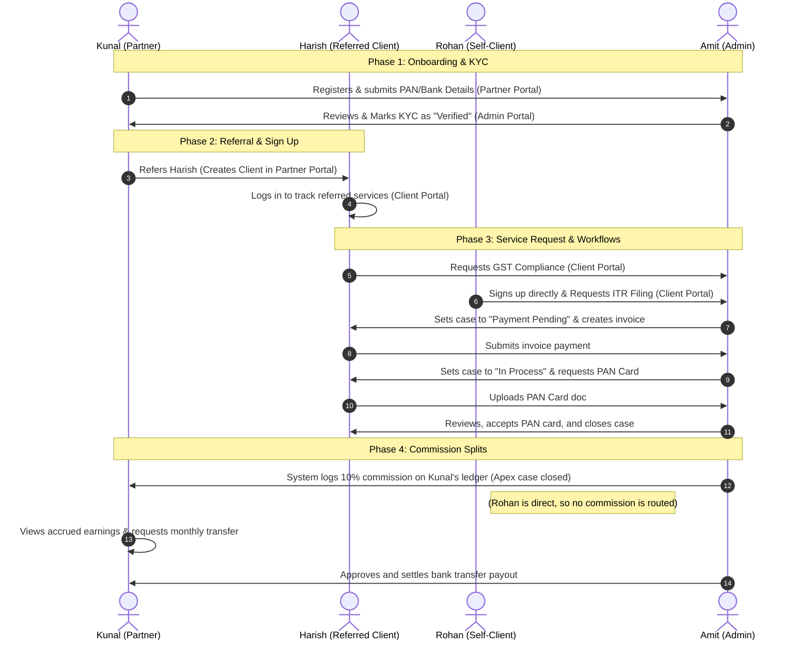

# Roleplay Flow: End-to-End Compliance & Referral Lifecycle

This document maps out a realistic business scenario showing how the **Partner Portal**, **Client Portal**, and **Admin Portal** interact during client referrals, compliance execution, and payout settlements.

---

## The Personas

1. **The Admin (Amit Bansal)**: Firm owner. Manages compliance filings, reviews case documents, updates cases, and approves partner payouts.
2. **The Partner (Kunal Shah - Zenith Advisors)**: Financial consultant. Refers business clients to A&A and tracks passive commission splits.
3. **The Referred Client (Harish Gupta)**: A business client referred by Kunal. Needs GST and Income Tax compliance services.
4. **The Self-Client (Rohan Mehta)**: A direct client who signs up independently on the marketing website.

---

## Interaction Architecture

---

## Detailed Step-by-Step Scenario

### Phase 1: Partner Onboarding & KYC Verification
*   **Kunal (Partner)** visits the portal, registers `Zenith Advisors`, enters their PAN, and configures their bank account for bank transfers. His status is set to `PENDING_VERIFICATION`.
*   **Amit (Admin)** logs in to the Admin Dashboard. Under the **Partners** tab, he sees `Zenith Advisors` listed as pending. He reviews the uploaded PAN document, verifies the details match, and clicks **Approve KYC**. Kunal's status transitions to `ACTIVE`.

### Phase 2: Referring a Client
*   **Kunal (Partner)** meets **Harish Gupta**, a local business owner who needs GST filings. 
*   Kunal logs into the **Partner Portal**, goes to the **My Referred Clients** page, and clicks **Refer New Client**. He enters Harish's name, email (`harish@gmail.com`), and phone.
*   The system creates a user login and client profile linked to Kunal's Partner ID.

### Phase 3: Direct vs. Referred Client Service Requests
*   **Harish (Referred Client)** logs in. He goes to **New Service Request**, selects **GST Registration & Compliance**, and submits it.
*   **Rohan (Self-Client)** lands on the public website, registers directly as a new client, and requests **Income Tax Return Filing**.
*   **Amit (Admin)** logs into the **Admin Portal** and sees two new cases on his dashboard:
    1.  `AA-CASE-1051` (GST Compliance for Harish Gupta) — *Source: Partner (PTR-101)*
    2.  `AA-CASE-1042` (Income Tax Return for Rohan Mehta) — *Source: Direct / Website*
*   Amit reviews the pricing, updates both cases to `Payment Pending`, and issues invoice links.
*   Both Harish and Rohan log in to their respective client portals, see their pending invoices, and submit payments.

### Phase 4: Compliance Execution
*   Once payments are processed, Amit updates the case statuses to `In Process`.
*   The workflow automatically issues a task: **Upload PAN Card**.
*   Harish and Rohan receive notifications, drag-and-drop their files into the **Documents** tab, and submit them.
*   Amit reviews the documents in the Admin Portal, clicks **Accept**, processes the tax filings, and updates the case statuses to `Closed`.

### Phase 5: Financial Settlement & Payouts
*   **Commission Splits**:
    *   For **Harish's case** (Value: ₹25,000, 10% Rev Share): The system automatically records a credit of **₹2,500** on Kunal's ledger.
    *   For **Rohan's case**: No commission is logged because his acquisition source is direct/website.
*   **Kunal (Partner)** logs into the **Partner Portal**. He visits the **Payouts & Earnings** page and sees:
    *   Total Earnings: ₹2,500
    *   Accrued Balance: ₹2,500 (Pending settlement)
*   At the end of the month, **Amit (Admin)** goes to the **Revenue / Payouts** tab in the Admin Portal, views Kunal's accrued balance of ₹2,500, verifies his bank details, and clicks **Settle Payout**.
*   The transfer is executed. Kunal receives a notification that ₹2,500 has been transferred to his HDFC Bank Account. His accrued balance resets to ₹0, and his transaction ledger marks the payout as `CLEARED`.
